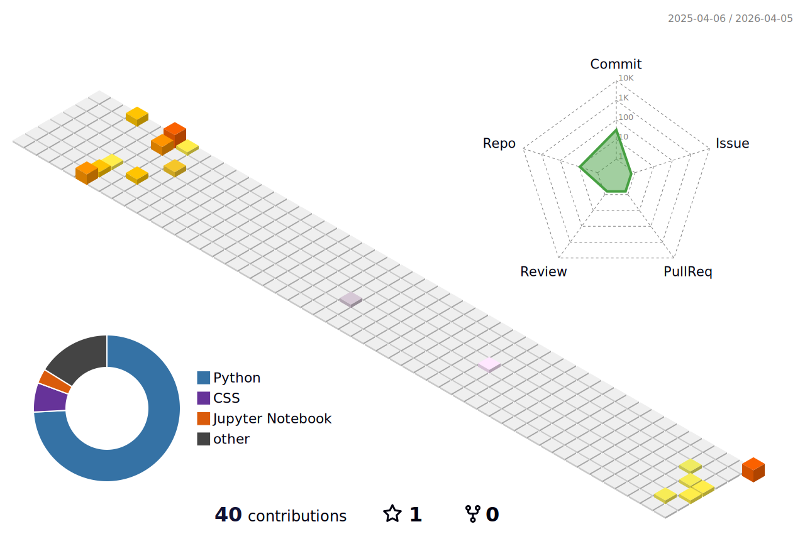

###

Hi, I'm <b>Ha Quang Minh</b>! Currently a <b>Data Science in Economics and Business</b> student at National Economics University in Vietnam.

I'm especially interested in <b>AI, machine learning, econometrics, forecasting, and practical data systems</b>. I like building things that go beyond polished demos — projects that can actually help with <b>real decisions, real workflows, and real data problems</b>.

Most of what I build sits somewhere between <b>research</b> and <b>implementation</b>: macroeconomic nowcasting, fraud detection, data-driven applications, and tools that make analysis more usable in practice.

 

###

<h4 align="left">Languages & Frameworks</h4>

  
  
  
  
  
  
  
  
  

###

<h4 align="left">Tools & Platforms</h4>

  
  
  
  
  
  
  
  
  
  
  

 

###

### Some personal info

- Interested in the intersection of **data science, economics, and AI**
- Like projects where **theory meets messy real-world data**
- Build things that are meant to be **useful**, not just visually impressive
- Currently drawn to **macroeconomic forecasting**, **fraud detection**, and **decision-support systems**
- Enjoy both **research-style problem solving** and **hands-on implementation**
- Care a lot about **clarity, rigor, and reproducibility**
- Outside of work and study: music, tech, exploring tools, and solving random niche problems that feel worth automating

 

###

### Featured repositories

- **Nowcasting-GDP-Growth** — real-time GDP growth nowcasting with econometric and data-driven modeling
- **Fraud-Detection** — suspicious pattern detection and risk-aware analytics
- **DBMS_The_learning_house** — database-oriented system design and structured backend logic
- **Thelearninghouse** — educational / learning platform development project

 

###

### GitHub activity

 

  

## Fun zone

### Breakout
<picture>
  <source media="(prefers-color-scheme: dark)" srcset="https://raw.githubusercontent.com/haminh109/haminh109/github-breakout/images/breakout-dark.svg">
  <source media="(prefers-color-scheme: light)" srcset="https://raw.githubusercontent.com/haminh109/haminh109/github-breakout/images/breakout-light.svg">
  
</picture>

### Pac-Man
<picture>
  <source media="(prefers-color-scheme: dark)" srcset="https://raw.githubusercontent.com/haminh109/haminh109/output/pacman-contribution-graph-dark.svg">
  <source media="(prefers-color-scheme: light)" srcset="https://raw.githubusercontent.com/haminh109/haminh109/output/pacman-contribution-graph.svg">
  
</picture>

###

  

