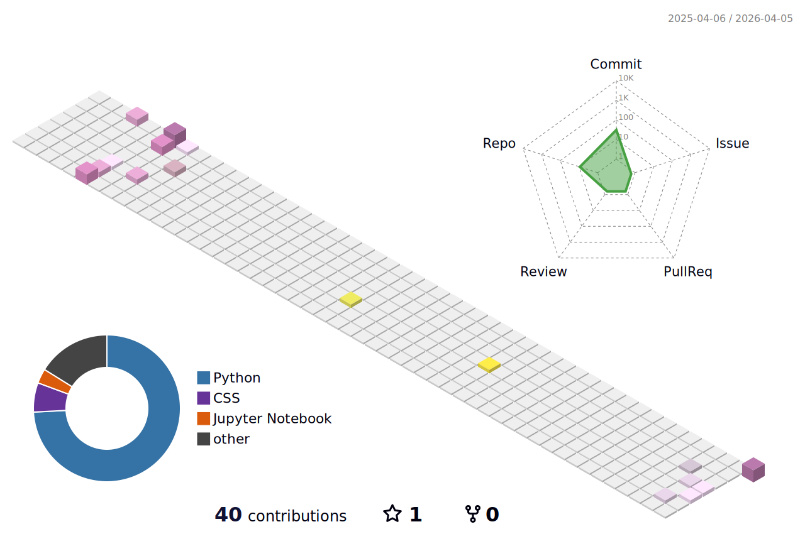

# Hi there 👀

I'm **Hà Quang Minh**! Currently a 3rd-year student majoring in Data Science in Economics and Business at National Economics University in Vietnam.

I have a strong passion for data analysis, time series forecasting, and competitive programming. I enjoy working with real-world datasets and building statistical models to solve complex problems, from scientific research to practical data pipelines.

### 🛠 Languages & Frameworks

  

### 💻 Tools & Platforms

  
  

### 📜 Certifications
- **Microsoft Certified: Power BI Data Analyst Associate (PL-300)**

### 🔭 Some personal info & what I'm working on
- 📈 Currently conducting scientific research (NCKH) focusing on **Portfolio optimization and index tracking** using meta-heuristic methods.
- 📊 Deeply interested in time series models (ARMA, AR, MA) - check out my **Nowcasting-GDP-Growth** project!
- 🧠 Spending my free time on algorithmic problem solving and competitive programming.
- 🎯 Previously organized the online Quiz Tết Nguyên đán 2026 for the Hoc24 & OLM communities and researched factors affecting Customer Satisfaction in Online Educational Platforms.

### 🐍 GitHub Activity

